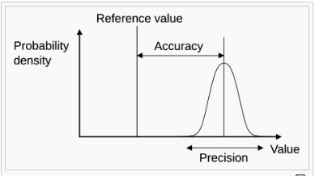
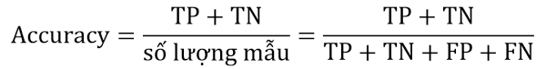
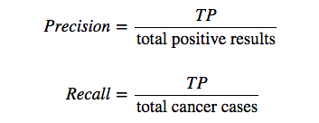
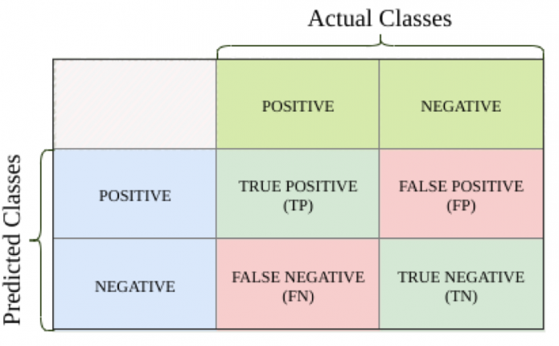
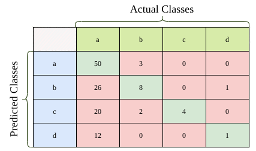
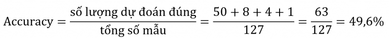
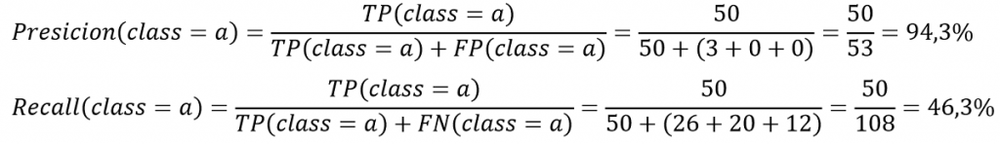

# Goal:

For each in the test set, you must predict a 0 or 1 value for the variable.

# Metric:

Your score is the percentage of passengers you correctly predict. This is known as [accuracy](https://en.wikipedia.org/wiki/Accuracy_and_precision#In_binary_classification).

# Submission

Submit a csv file with exactly 418 entries **plus** a header row. Your submission will show an error if you have extra columns (beyond PassengerId and Survived) or rows.

The file should have exactly 2 columns:

* PassengerId (sorted in any order)
* Survived (contains your binary predictions: 1 for survived, 0 for deceased)

```markdown
PassengerId,Survived
892,0
893,1
894,0
Etc.
```

---

# Mục tiêu:

Với giá trị dự đoán trong tệp kiểm tra, phải dự đoán gái trị 0 hoặc 1 cho biến.

# Đơn vị đo lường:

Là tỉ lệ phần trăm hành khách mà bạn dự đoán chính xác. Được gọi là độ chính xác `accuracy`.

### Sơ lược accuracy:

**độ chuẩn xác** (accuracy) là **độ** gần của các phép đo với một giá trị cụ thể, trong khi **độ chính xác phép đo** (precision) là **mức độ** gần của các phép đo với nhau.

maDùng để:

* * **mô tả về các*[lỗi hệ thống](https://vi.wikipedia.org/w/index.php?title=L%E1%BB%97i_quan_s%C3%A1t&action=edit&redlink=1 "Lỗi quan sát (trang không tồn tại)")* , thước đo [sai lệch thống kê](https://vi.wikipedia.org/w/index.php?title=Sai_l%E1%BB%87ch_th%E1%BB%91ng_k%C3%AA&action=edit&redlink=1 "Sai lệch thống kê (trang không tồn tại)"); độ chính xác thấp gây ra sự khác biệt giữa kết quả và giá trị "đúng". [ISO](https://vi.wikipedia.org/wiki/T%E1%BB%95_ch%E1%BB%A9c_ti%C3%AAu_chu%E1%BA%A9n_h%C3%B3a_qu%E1%BB%91c_t%E1%BA%BF "Tổ chức tiêu chuẩn hóa quốc tế") gọi đây là trueness.
  * mô tả sự kết hợp của cả hai loại [lỗi quan sát](https://vi.wikipedia.org/w/index.php?title=L%E1%BB%97i_quan_s%C3%A1t&action=edit&redlink=1 "Lỗi quan sát (trang không tồn tại)") ở trên (ngẫu nhiên và có hệ thống), vì vậy độ chính xác cao đòi hỏi cả độ chính xác cao và độ chính xác cao.
  * *Độ chính xác phép đo (precision)* là một mô tả về  *[các lỗi ngẫu nhiên](https://vi.wikipedia.org/w/index.php?title=L%E1%BB%97i_quan_s%C3%A1t&action=edit&redlink=1 "Lỗi quan sát (trang không tồn tại)")* , thước đo độ [biến thiên thống ](https://vi.wikipedia.org/w/index.php?title=Bi%E1%BA%BFn_thi%C3%AAn_th%E1%BB%91ng_k%C3%AA&action=edit&redlink=1 "Biến thiên thống kê (trang không tồn tại)")kê.
* ### Công thức:

  |  |  |
  | -------------------------------------------- | -------------------------------------------- |

  * True Positive (TP): predict và actual đều là positive (mô hình phân loại đúng mẫu positive)
  * False Positive (FP): actual là positive nhưng predict lại là negative (mô hình bị nhầm lẫn mẫu positive là negative)
  * True Negative (TN): predict và actual đều là negative (mô hình phân loại đúng mẫu negative)
  * False Negative (FN): actual là negative nhưng predict là positive (mô hình bị nhầm lẫn mẫu negative là positive)



Example:



Giả sử kết quả dự đoán của mô hình phân loại được thể hiện ở ma trận confusion trình bay ở trên. Có tổng 127 mẫu. Bây giờ hãy đánh giá mô hình



Như vậy, mô hình phân loại đã phân loại chính xác gần ½ số mẫu.

Tính toán Precision và Recall sẽ phức tạp hơn so với phân loại nhị phân. Không thể nói Precision hay Recall tổng thể của cả mô hình phân loại mà sẽ tính precision và recall ở mỗi lớp riêng biệt.

Mỗi lớp, cần xác định được TP, TN, FP và FN. Từ đó xác định được precision và recall:



Tính precision và recall ở các lớp còn lại:


